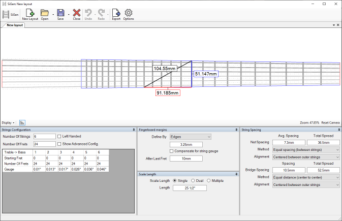

# SiGen
Stringed Instrument Layout Generator

SiGen is a fully-fledged application to design and generate stringed instrument layouts.

While the app is focused around guitar and bass fretboards, 
it can be used to design layouts for many other instruments. 

Features:
* On-screen measure tool.
* Can handle imperial and metric values. 
* Undo/redo system (sounds like a basic feature but thrust me it was not easy to implement)
* Can export to SVG and DXF