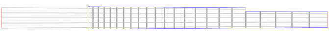

# SiGen
**S**tringed **I**nstrument Layout **Gen**erator

SiGen is a fully-fledged application to design and generate stringed instrument layouts.

While the main focus is around guitar and bass fretboards, 
it can be used to design layouts for many other instruments. 

Here are some examples of what it can do:

**5 Strings Banjo** *parametrable starting fret*

**Dual scale** *along with by-string number of frets*

**Multi scale** *by-string scale length*

___

**Notable features:**
* Can export to SVG and DXF.
* On-screen measure tool. 
* Can handle imperial and metric values. 
* Undo / redo history.
